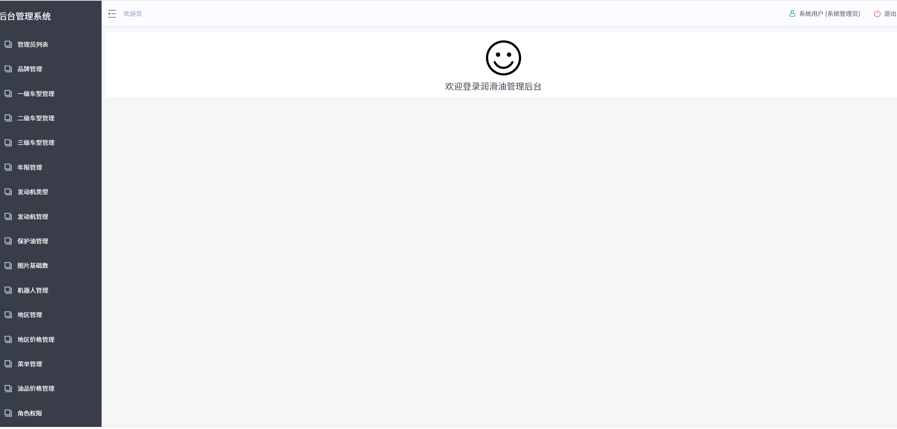

# 1.项目描述
一个在线查询汽车润滑油的系统，分为移动端和pc端，移动端可根据品牌查询合适的润滑油，PC端属于管理后台，根据相关信息录入汽车合适的润滑油
信息。

# 2.技术涉及
springBoot+springSecurity+springCloud+Redis+zuul+feign+consul+springData+spring-boot-admin+nginx+vue

前端技术：

* 基础的HTML、CSS、JavaScript（基于ES6标准）
* JQuery
* Vue.js 2.0
* 前端构建工具：WebPack
* 前端安装包工具：NPM
* Vue脚手架：Vue-cli
* Vue路由：vue-router
* ajax框架：axios
* element-ui

后端技术：

* 基础的SpringMVC、Spring 5.0
* mysql5.6
* Spring Boot 2.2.7版本
* Spring Cloud Hoxton.SR3
* Redis-5.0
* consul 1.7.1
* nginx-1.13.7：

# 3.系统架构

# 4.数据库设计 
数据库表

数据表关系

# 5.项目结构
* adminservice：后台管理系统后台
* brandserver：品牌管理模块
* gateserver：网关模块
* fileservice：图片上传模块
* common：通用工具模块
* mobileservice：移动端模块
* userservice：用户管理模块
* olisclient：后台管理系统前端
* olisclient-mobile：移动端前台

整个项目可以分为两部分：后台管理系统、移动端。

后台管理：

后台系统会采用前后端分离开发，而且整个后台管理系统会使用Vue.js框架搭建出单页应用（SPA）。

后台系统主要包含以下功能：
* 品牌管理:品牌增删查改
* 一级分类管理:一级车型增删查改
* 二级分类管理:二级车型增删查改
* 三级分类管理:三级车型增删查改
* 年限管理:发动机年限增删查改
* 发动机类型管理:发动机类型增删查改
* 发动机管理:根据品牌，一级分类，二级分类，三级分类，年限，发动机类型，油品信息增加一条匹配记录表，并可以进行删除，修改操作
* 保护油管理:润滑油的增删查改
* 图片基础管理:包含发动机图片和油品图片的增删查改
* 机器人管理:管理移动端设备的授权信息
* 角色管理:角色的增删查改
* 菜单管理：菜单的增删查改
* 管理员列表:用户的增删查改

预览图：

移动端基于app或是网页形式展现

预览图：

# 6.Nginx配置
server {
	listen       80;
	server_name  manage.leyou.com;

	proxy_set_header X-Forwarded-Host $host;
	proxy_set_header X-Forwarded-Server $host;
	proxy_set_header X-Forwarded-For $proxy_add_x_forwarded_for;

	location / {
		proxy_pass http://127.0.0.1:9001;
		proxy_connect_timeout 600;
		proxy_read_timeout 600;
	}
}
server {
	listen       80;
	server_name  api.leyou.com;

	proxy_set_header X-Forwarded-Host $host;
	proxy_set_header X-Forwarded-Server $host;
	proxy_set_header X-Forwarded-For $proxy_add_x_forwarded_for;
	# 转发时，携带自身的host，而不是转发后的host(127.0.0.1)
	proxy_set_header Host $host;

	# 上传路径的映射
	location /api/upload {	
		proxy_pass http://127.0.0.1:8082;
		proxy_connect_timeout 600;
		proxy_read_timeout 600;
		# 对请求路径进行重写 eg：/api/upload/image -> /upload/image
		rewrite "^/api/(.*)$" /$1 break; 
	}
	
	location / {
		proxy_pass http://127.0.0.1:10010;
		proxy_connect_timeout 600;
		proxy_read_timeout 600;
	}
}
server {
	listen       80;
	server_name  www.leyou.com;

	proxy_set_header X-Forwarded-Host $host;
	proxy_set_header X-Forwarded-Server $host;
	proxy_set_header X-Forwarded-For $proxy_add_x_forwarded_for;
	
	location /item {
		# 先找本地
		root html/leyou;
		if (!-f $request_filename) { # 请求的文件不存在，就反向代理
			proxy_pass http://127.0.0.1:8084;
			break;
		}
	}
	
	location / {
		proxy_pass http://127.0.0.1:9002;
		proxy_connect_timeout 600;
		proxy_read_timeout 600;
	}
}
